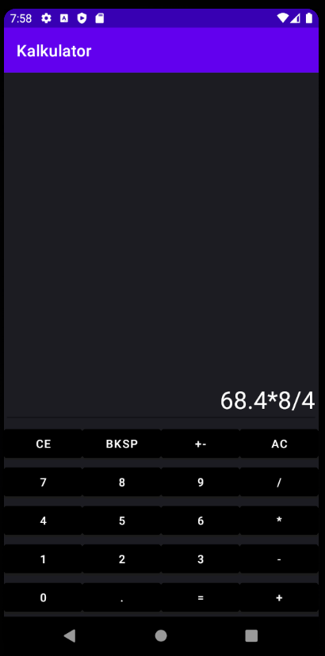
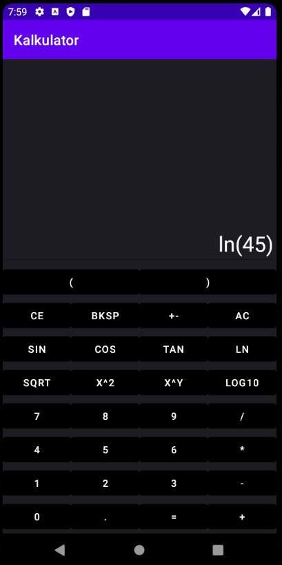
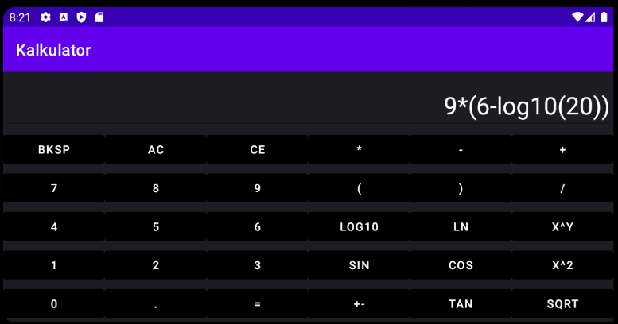

# Calculator app
Simple app containing two versions of the calculator: simple and advanced

## Table of contents
* [General info](#general-info)
* [Technologies](#technologies)
* [Screens](#screens)
## General info
This project containing calculator. We can choose simple calculator with four basic operations: addition, subtraction, multiplication and division. 
Also app has advanced calculator, which extending simple calculator, and this allows to do more complicated operations such as: logarithms, trigonometric functions(sin, cos, tan), exponentiation,
extraction of a root. App will be run on devices at least Android 8.0 and minimum API Level: 26

## Technologies
Project is created with:
* java version: 1.8.0_281
* mXparser version: 4.4.0
* Android Studio version: 4.1

## Screens
 
 

